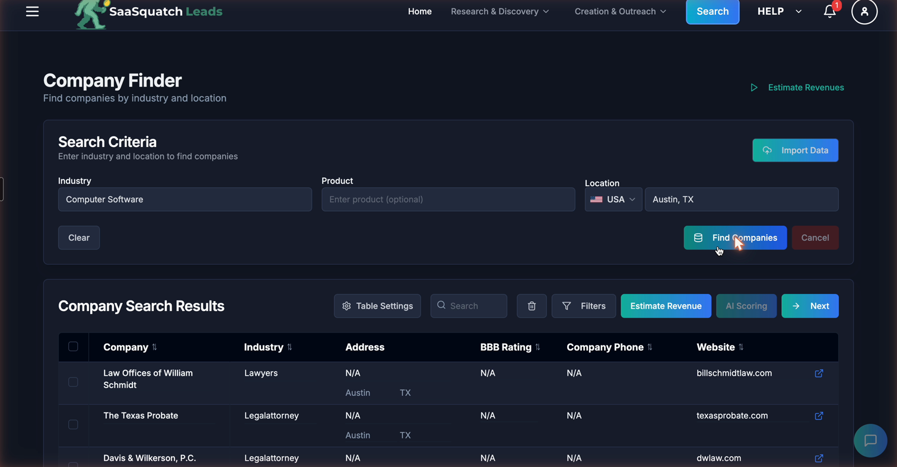
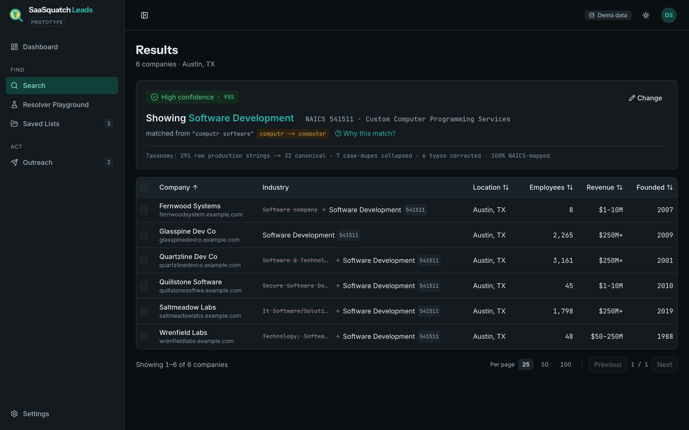

# SaaSquatch Leads — quality-first rebuild

> **Live demo:** [saasquatch-signal.vercel.app](https://saasquatch-signal.vercel.app) — one-click demo sign-in, no signup
> **Video (90s):** _link in the submission email_
> **Run locally:** `npm i && npm run dev` → `demo@saasquatch.test` / `demo1234`

**Lane: Quality.** One critical defect found by using the product, fixed at the algorithm
layer, and carried through the whole workflow. Built against a written spec
([BUILD_SPEC.md](BUILD_SPEC.md), [PLAN.md](PLAN.md)) with a
[time log](docs/time-log.md) — **~4½ hours of tracked build time** across sessions.

---

## Before / after — the same search

Search the live product for **Industry: Computer Software** in **Austin, TX** (picked from its
own autocomplete) and every one of the 150 results is a law firm. No error, no warning.

| Their live app (captured 15 Sep 2026) | This rebuild — misspelled on purpose |
|---|---|
|  |  |

The captured request behind their result:

```
POST https://data.saasquatchleads.com/api/naics/fetch_leads   → 200
{"industry": "Computer Software", "location": "Austin, TX, USA"}

→ "Showing 1-25 of 150 results"
   Page-1 industries: Legalattorney ×17 · Lawyers ×4 · Business Law Attorneys ×3
   Zero software companies.
```

The endpoint is namespaced `/naics/` — resolving an industry phrase to a NAICS code was clearly
the intended design. **That resolution layer doesn't exist**, so the string falls through and the
query silently returns the wrong industry. A searcher builds a target list, sends outreach, and
only then discovers every recipient was a law firm. Silent wrongness destroys trust in a
sourcing tool faster than any error message could.

Full evidence — five findings reproduced live, with screenshots, DOM proofs, and the complete
287-string industry dump — in [docs/evidence/findings.md](docs/evidence/findings.md).

## What I built

**1 · The Industry Resolver.** A real data pipeline over their real data: the 291 industry
strings captured unedited from their production autocomplete
([data/raw-industries.json](data/raw-industries.json)) are normalised, spell-corrected
(their shipped typos: `Busines software`, `Producitvity`, `Verical Saas…`), and collapsed into
32 canonical industries, each mapped to a 2022-revision NAICS code. At search time,
`resolveIndustry()` corrects the user's input, matches it (exact → alias → weighted fuzzy), and
returns a confidence score with the full derivation. **Below 60% confidence it blocks the search
and offers alternatives instead of guessing** — that product decision, not the fuzzy matcher, is
the fix for the law-firm bug. A [match transparency panel](docs/evidence/after-results-dark.png)
above every result set shows exactly what was matched and why, and a **Resolver Playground** in
the sidebar lets you type anything — typos included — and watch the derivation live.

**2 · The continuous workflow.** In their product, a 150-result search leaves the dashboard at
`Total Leads: 0` and `/lead/companies` at "Showing 1–0 of 0 results" — results simply evaporate.
Here the loop closes: select results → save to a list (toast with a true Undo — it removes only
what that save added) → export CSV → **draft outreach prefilled from data the app already
holds**. Their Email Generator demands 60+ hand-typed words of "context" per lead and then
paraphrases them; that's backwards. This compose screen writes all three context points itself —
industry + NAICS sector, size + founding year, location + regional market — deterministically,
each editable and regenerable. The human edits; the tool does the first draft.

## The metric

```
✓ Taxonomy built: 291 raw strings → 32 canonical industries
  · 7 case-duplicates collapsed
  · 6 typo corrections applied (busine→business, producitvity→productivity,
    emergy→energy, verical→vertical ×2, esate→estate)
  · 100% mapped to NAICS (2022 revision)
```

Printed on every build (`npm run taxonomy`), asserted by the test suite, and shown inside the
product itself — the transparency panel's footer carries it on every results page. Every number
is real: the inputs are their production strings, and all six corrected typos shipped in their
live database on the day of capture.

## Design decisions

- **Navigation by job, not by feature.** Their 12 destinations across two mega-dropdowns (two
  of them "Soon") become a sidebar with two groups — FIND and ACT — because that is the
  sequence a searcher actually works.
- **Confidence is a product surface.** Three bands: ≥85% applies, 60–84% applies but flags,
  <60% **blocks**. Semantic band colours are separate from the brand colour, and confidence is
  never colour alone — always colour + icon + label.
- **Show the work.** The derivation chain (typed → normalised → corrected → matched → NAICS)
  is one click from every search. The thesis of the build: a lead tool's currency is trust,
  and trust comes from showing what you matched.
- **Their identity, kept.** Same name, teal DNA, a redrawn original mark (a magnifying glass
  over a footprint — a footprint is a lead). This reads as "improve their product," not
  "replace it."
- **No LLM anywhere.** The resolver and the outreach prefill are deterministic: no API keys,
  no per-seat inference cost, identical output every run, works offline.
- **Accessibility as a floor, not a feature.** Full ARIA combobox with keyboard navigation
  (their dropdown has none, never closes, and covers the submit button — regression-tested
  here), aria-live errors, `prefers-reduced-motion`, Lighthouse accessibility **100** on the
  deployed login page ([evidence](docs/evidence/lighthouse-login.json)), chart palette
  machine-validated for colour-vision deficiency in both themes.

## What I deliberately did not build

- **AI lead scoring.** It already exists — there's an **AI Scoring** button in their results
  toolbar (visible in the before-screenshot) and an `api.saasquatchleads.com/ai-score` endpoint.
  Rebuilding a shipped feature would prove I never used the product.
- **More data sources / more leads.** That's the quantity lane; the handbook says pick one.
- **Integrations, CRM sync, extensions.** Not verifiable by a reviewer inside a 5-hour artifact.

## Architecture

- **Frontend / backend:** Next.js 15 App Router, TypeScript, React Server Components with
  server actions for every mutation (auth-checked, ownership-checked, runtime-validated).
  Tailwind CSS v4 over a token design system (§9 of the spec): 1.25 type scale, 4px grid,
  light + dark as first-class themes.
- **Data storage:** SQLite via `better-sqlite3` — a deliberate fit for a synthetic-seed
  prototype: zero-cost, zero-config, in-process reads. Schema:
  companies / contacts / lists / list_items / drafts / search_logs / users, FK-enforced with a
  deterministic seed (fixed-PRNG, planted duplicate pair for the dedup pass).
- **Caching & performance:** the taxonomy compiles at build time (`seed && taxonomy && build`);
  the Fuse.js index and prepared statements build once per process at module scope; public
  pages are statically prerendered; app routes are server-rendered on demand. First-load JS on
  the dashboard is ~107KB — their single route shipped ~40 script chunks.
- **Hosting / deployment:** Vercel (serverless, Hobby tier — the whole build is $0). Deploys
  from `main` via CLI; `npm run build` seeds and compiles the taxonomy on the build machine,
  and `outputFileTracingIncludes` bundles the seeded database into each function.
- **Serverless SQLite, honestly:** Vercel's filesystem is read-only, so at cold start the
  bundled database is copied to `/tmp` — every write works within an instance's lifetime, and
  the demo resets when instances recycle. Long-lived JWT sessions can outlive a reset, so the
  layout detects orphaned sessions and signs them out cleanly. Local runs have full persistence.
- **Scalability & swap-in:** the resolver is O(1) for exact/alias hits and one in-memory index
  scan for fuzzy; the taxonomy is compile-time data. Swapping the synthetic seed for their live
  `fetch_leads` backend means replacing one query module (`lib/search.ts`) — the resolver sits
  in front of either. At real scale the same pipeline runs unchanged; SQLite hands over to
  Postgres by swapping the driver behind `lib/db.ts`.
- **Enrichment & dedup:** every lead is enriched from its messy source string to a canonical
  industry + NAICS code/title/sector (kept side by side — `rawIndustry` is displayed struck
  through next to the resolved label, so the fix is visible per row). Dedup runs at two levels:
  291 strings → 32 canonical entries, and a fuzzy duplicate-company pass in the seed pipeline
  (name-similarity + same city; the log records what merged).
- **Testing:** 31 vitest cases — the taxonomy pipeline against their real typos, the
  refuse-to-guess regression (a match sharing only generic tokens can never score confident),
  the F-02 combobox behaviours (Escape, outside click, keyboard selection), template
  determinism, CSV escaping incl. the formula-injection guard.

## Data honesty

Every company is **synthetic and labelled as such** — a `Demo data` badge sits in the header of
every screen, and no real business is named. What's real: the 291 raw industry strings (captured
from their production DOM, unedited, provenance in the file), the NAICS codes (US Census, public
domain), the resolver, and the pipeline metrics. The architecture is built to swap the seed for
their live endpoint.

## Run locally

```bash
npm install        # seeds the demo database on first run (npm run dev does it too)
npm run dev        # → http://localhost:3000
npm test           # 31 tests
npm run taxonomy   # rebuild the taxonomy and print the reduction metric
```

Sign in with the one-click demo button, or `demo@saasquatch.test` / `demo1234`.
No paid keys, no third-party credentials; the only env var is a self-generated `AUTH_SECRET`
(see `.env.example` — any random string works).

## With another week

- Wire the resolver in front of their live `fetch_leads` endpoint behind a feature flag and
  measure precision against the synthetic-seed baseline.
- Expand the raw capture beyond the "Software" query slice — the full vocabulary is larger
  than 291 strings — and version taxonomy builds so mappings are diffable in review.
- Persist demo writes (Turso/libSQL keeps the SQLite model; Postgres if the data outgrows it).
- Saved buy boxes (named, reloadable filter sets) and column preferences.
- An evaluation harness for the resolver: a labelled query set, confusion matrix per band,
  and threshold tuning from logged real searches.

---

*Built for the Caprae Capital AI-readiness pre-screening. Spec-first: the brief in
[BUILD_SPEC.md](BUILD_SPEC.md) was written before the code, findings verified on the live
product before anything was built, and every sprint closed with a deploy —
[docs/time-log.md](docs/time-log.md).*
